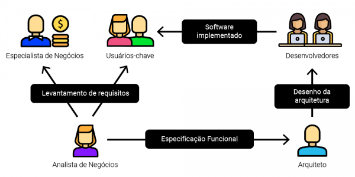
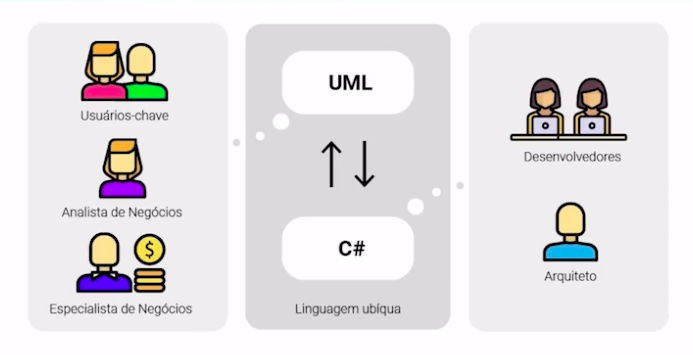
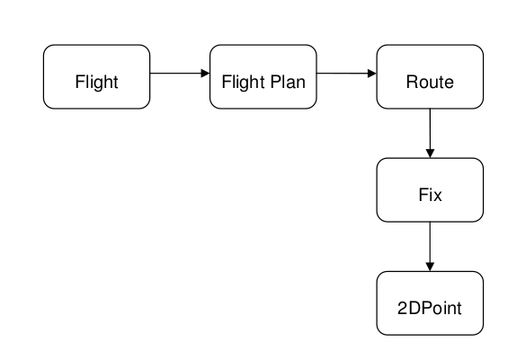
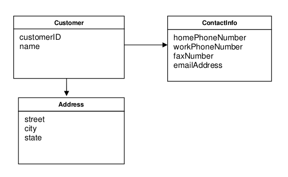
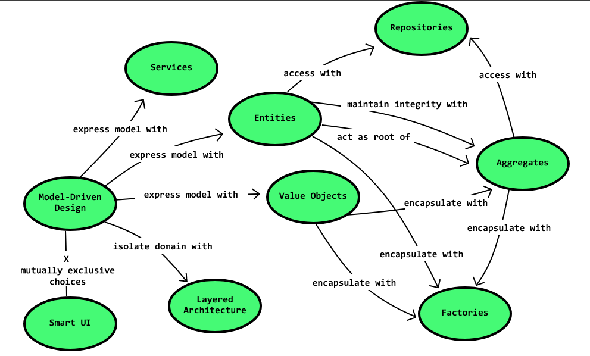

# DDD
DDD é um conjunto de conceitos utilizados para criação de software, que busca definir modelos e escopos de software focados em negócio.
  
Com ele, garantimos que os escopos e modelos de negócio principais sejam definidos, isolados, e mantidos com o passar do tempo, sobrevivendo a novo desenvolvimento e aperfeiçoamento de código.

 

## Domínio 

Domínio é o coração do negócio. É baseado em um conjunto de ideias, conhecimento e processos de negócio. É a razão do negócio existir.  
Sem o domínio todo o sistema, todos os processos auxiliares, não servirão para nada. 

 
 

## Linguagem Ubíqua 
Quando falamos de levantamento de requisitos e desenho de solução, nossa <b>estrutura antiga</b> se dava da seguinte forma:

   

<i>
O analista de negócios levantava os requisitos com os usuários chave e fazia a <b>visão dele</b> de como a solução deveria ser feita. 
O Arquiteto conversava com o analista, tirava suas conclusões e fazia um desenho de arquitetura com a <b>sua visão</b> sobre a solução. 
Os desenvolvedores liam o desenho e tiram as conclusões para o desenvolvimento de software com a <b>sua visão</b>.
</i>
  
O problema disso? A versão final era muito diferente com a que o usuário necessitava, o que gerava muito retrabalho e ajustes.
  
Sendo assim se observou que é necessário trazer <b>todos os envolvidos ao desenho da solução</b>, sendo eles experts de negócio, analistas, desenvolvedores e arquitetos.
  
Porém inicialmente pessoas de negócio e desenvolvedores não se entendem tão bem, até mesmo desenvolvedores e arquitetos, sendo assim é necessário uma linguagem ubíqua, e com ela todos devem conseguir se entender.
  
O fluxo de levantamento de requisitos e desenho de solução fica da seguinte forma, onde a linguagem ubíqua é usada como apoio para elaboração dos modelos, sejam UML ou qualquer outro diagrama:

   

#### E como criamos o modelo de solução fazendo uso da linguagem ubíqua?

- Analise o fluxo de negócio do software compreendendo todos os principais modelos envolvidos 

- Se possível faça um rascunho dos modelos(entidades) em alguma linguagem de programação, para encontrar possíveis falhas de relacionamento 

- Utilize uma ferramenta para definição de diagramas para desenhar os modelos e seus atributos, onde todos consigam ter um bom entendimento, por exemplo UML. 

  
  
Exemplo de uma conversa entre desenvolvedor e expert de negócio, onde são observados os domínios:
  

<b>Developer</b>: We want to monitor air traffic. Where do we start?
 
<b>Expert</b>: Let's start with the basics. All this tramc is made up of 
<b>planes</b>. Each plane takes off from a <b>departure</b> place, and lands 
at a destination place. 
 
<b>Developer</b>: That's easy. When it flies, the plane can just choose 
any air path the pilots like? Is it up to them to decide which way 
they should go, as long as they reach destination? 
 
<b>Expert</b>: Oh, no. The pilots receive a <b>route</b> they must follow. 
And they should stay on that route as close as possible. 
 
<b>Developer</b>: I'm thinking of this <b>route</b> as a 3D path in the air. If 
we use a Cartesian system of coordinates, then the <b>route</b> is 
simply a series of 3D points. 
 
<b>Expert</b>: I don't think so. We don't see <b>route</b> that way. The 
<b>route</b> is actually the projection on the ground of the expected air 
path of the airplane. The <b>route</b> goes through a series of points on 
the ground determined by their <b>latitude</b> and <b>longitude</b>. 

Na conversa foram encontradas diversas palavras que sugerem domínios a serem considerados no modelo: 

   
 
 

## Separação de Layers

Um padrão comum para desenvolvimento de aplicações com DDD é a <b>separação de layers</b>.
  
A separação mais comum é: <b>UI – Application Layer – Domain Layer – Infraestructure Layer</b>. 
  
<i>Sempre lembrando que uma camada deve sempre acessar a de baixo, e ser desacoplada para acesso as camadas de cima.</i>
  
Podemos assumir um paradigma similar tanto em nossa arquitetura macro quanto em nossa arquitetura intra-code: 

 

<b>Intra-code:</b>

- UI: interfaces de usuário(não utilizadas) 
- Application Layer: Nossa camada de apis 
- Domain Layer - Service: Camadas de serviço onde temos controle sobre regras de negócio 
- Domain Layer - Domain: Camadas de serviços onde temos controle apenas do domínio 
- Infrastructure Layer: Repositories, Utils, Clients, Consumers, Producers 

 

<b>Arquitetura:</b> 

- UI: Aplicações front-end e de acesso pelo usuário 
- Application Layer: Serviços BFF e iniciadores de processos 
- Domain Layer - Service: Serviços de negócio 
- Domain Layer - Domain: Serviços de domínio 
- Infrastructure Layer: Configs, Vault, Bancos de dados, ElasticSearch 

 

 
 

## Bounded Context 

 

Os Bounded Contexts ou contextos delimitados, delimita os contextos da aplicação.
  
Cada contexto possui suas responsabilidades claramente definidas que por sua vez pode ter sua própria linguagem Ubíqua.
  
A utilização de histórias e levantamento do escopo do projeto com o Domain Expert auxilia no processo de delimitação de contexto. 

 
 

## Modules 

 

Em modelos de aplicações complexos, os modulos são usados para aumentar coesão e diminuir acoplamento. 
  
São usados mais em monolitos e serviços maiores, como por exemplo o core bancário, que pode ser dividido nos seguintes modulos, CONTA, TRANSFERENCIA, INVESTIMENTO, PAGAMENTO, etc. 
 
(não vejo que faça sentido para nosso ambiente de Microservices) 

 

 
 

## Values 

 

São objetos que são necessários para o funcionamento interno de nossa aplicação, principalmente utilizados na camada de negócio.  
Eles não são persistidos, sendo assim são facilmente descartados.  
Um exemplo desse tipo de objeto usado em nosso dia a dia são os DTOs.  

 
 

## Aggregates 

 

São objetos que agrupam várias entidades associadas, que fazem parte do mesmo contexto. Por exemplo: 
 
Customer: 

   
 

É o modelo default de definição quando criamos entidades utilizando inner objects que são outras entidades, por exemplo. 

 

  

## Factories 

 

São classes responsáveis única e exclusivamente pra criação de outras classes. 
  
Úteis para remover de dentro da nossa classe que cuida de business ou domain a criação de objetos complexos, com muitos relacionamento, aggregates ou objetos genéricos. 

 

 
  

## Repositories 

Tem o propóstio de encapsular toda a lógica necessária para obter ou salvar registros junto ao modelo de infraestrutura definido. 

 

 
  

## Refatoramento contínuo 

Técnica usada pra checkar se os domínios estão como deveriam, e caso algo esteja fora de contexto realizar o refatoramento de código. 
  
É de grande valia o refatoramento continuo para quebrar linhas de raciocínio que não necessariamente são certas, se parado e visto de outra forma. 
Também traz um certo risco, devido a comportamentos inesperados em grande refactoring. 

   

--------------------------
 Ao final podemos interpretar esses conceitos da seguinte forma: 
   
 
  

## Preservação de integridade de Modelo 

- <b>Bounded Context</b>  
  É  definido o escopo principal de um contexto, e com isso são definidos os limites até onde esse escopo vai. Após isso podemos escrever os serviços e modelos que são incluídos nesse contexto. 
    
  Após já construído e definido modelo, serviços e times relacionados ao escopo, fazer o máximo possível para manter os modelos unificados dentro do escopo. 
  
- <b>Continuous Integration for Integrity Domain Tests</b> 
  Após o modelo definido e times trabalhando, a tendência de fragmentar o modelo é cada vez maior. Com isso o modelo pode ser incorretamente fragmentado, e com isso perder um nível valioso de integração e coerência. 
    
  Para manter a casa em ordem, é necessário que exista um processo que garanta que novas adições não danifiquem o modelo, como o uso de casos de testes que validem a integridade do modelo. 
  
- <b>Checking Context Map</b>  
  Após o modelo definido e times trabalhando, a tendência de fragmentar o modelo é cada vez maior. Com isso o modelo pode ser incorretamente fragmentado, e com isso perder um nível valioso de integração e coerência.
    
  Para manter a casa em ordem, é necessário que exista um processo que garanta que novas adições não danifiquem o modelo, como o uso de casos de testes que validem a integridade do modelo.
  
- <b>Customer-Supplier Strategy</b> 
  Quando dois times tem um relacionamento especial entre seus projetos, com alta dependência de um deles, e os times aceitam que exista essa dependência, devem ser tomados certos cuidados para o time que fornece os recursos não mudar drasticamente seus modelos para não quebrar o time que faz uso desses recursos. 
    
  Por exemplo, existe o time que cuida da aplicação web e core e o time que cuida da aplicação de relatórios, e a aplicação de relatórios utiliza da mesma estrutura de database que a equipe do core. 
    
  Deve ser criado uma interface que atuará no compartilhamento de dados entre os dois times e a estrutura de modelo dessa interface deve ser mantida ou os dois times devem trabalhar juntos para mudança necessária. 
    
  Devem ser tomados medidas para garantir isso, como testes de aceitação nessa interface. 
  
- <b>Conformist Strategy</b> 
  Quando dois times tem um relacionamento com alta dependência de um deles, e existe muito valor em reutilizar o modelo feito pelo time que o fornece, porém não há maiores responsabilidades que eles continuarão tomando certos cuidados em manter o modelo, o time consumidor deve fazer o uso de uma Anti-Corruption Layer. 
  
- <b>Anti-corruption layer</b>  
  Quando temos um sistema legado, com código muito bagunçado e uma interface complexa, e estamos escrevendo um sistema novo com o código razoavelmente bem feito, criamos uma camada entre esses dois sistemas. O nosso sistema novo e bem feito falará com essa camada, que possui uma interface bem feita. E a camada anti-corrupção é responsável por traduzir e adaptar as chamadas para o sistema legado, usando uma fachada interna 
  
- <b>Separate Ways</b> 
  Os times não querem manter dependência, são fluxos de trabalhos muito diferente, ou até mesmo o time produtor consome muito tempo garantindo integridade de modelo para o time consumidor. 
    
  Quando analisamos os pontos positivos e negativos de termos a integração entre dois escopos diferente usando o mesmo modelo, e existir mais problemas do que vantagens, temos que tomar caminhos separados. 
    
  Separate Ways se encaixa quando temos um modelo de aplicação empresarial com vários pequenos pedaços que não tem correlação de uma perspectiva de modelo. 
   
  Para o usuário final até pode ser a mesma aplicação, mas numa perspectiva de modelo não tem muitas ligações entre escopos. 
  
- <b>Open-Host Service</b>  
  Geralmente quando temos um serviço externo, pensamos em uma camada de interface para utilizar junto ao nossos serviços interno. 
    
  Quando temos poucos a mais até faz sentido termos a expansão dessa camada dentro de nosso serviço interno. 
    
  Mas quando temos diversos subsystem a serem integrados, ou a camada a ser expandida ia ficar muito grande, ou teríamos que replicar o uso de interfaces entre diversos serviços. 
    
  Nesse caso a solução é uma camada de subsystem como provider para cada pedaço do serviço externo, como se fosse um serviço para cada subdomínios do serviço externo. 
  
- <b>Distillation</b>  
  Mesmo tomando uma série de precauções e boas práticas, ainda podemos ter muitos dominios com modelos grandes. 
    
  Nesses casos pode ser necessário a extração.
    
  A extração se dá entendendo um Core Domain que representa a essência do domínio, e após isso fazer a extração das subpartes para subdominios mais genéricos. 
    
  <i>Trabalhando com modelos grandes, devemos separar os conceitos essenciais dos genéricos. </i>

 
